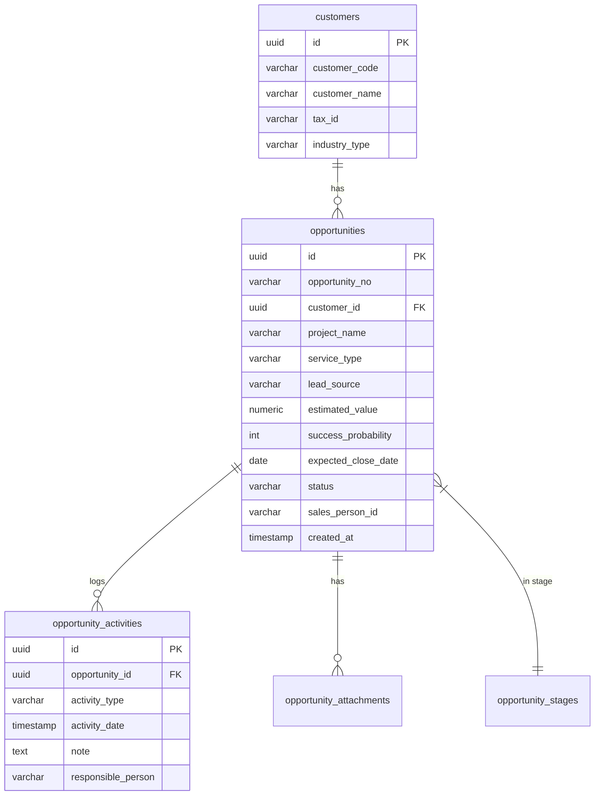

# Enterprise CRM Opportunity Management

## 1. Database ER Diagram


## 2. SQL Schema (PostgreSQL / Supabase)
```sql
CREATE EXTENSION IF NOT EXISTS "uuid-ossp";

CREATE TABLE opportunities (
    id UUID PRIMARY KEY DEFAULT uuid_generate_v4(),
    opportunity_no VARCHAR(50) UNIQUE NOT NULL,
    customer_id UUID REFERENCES customers(id) ON DELETE CASCADE,
    project_name VARCHAR(255) NOT NULL,
    service_type VARCHAR(100),
    lead_source VARCHAR(100),
    estimated_value NUMERIC(15, 2) DEFAULT 0,
    success_probability INT DEFAULT 0,
    expected_close_date DATE,
    status VARCHAR(50) DEFAULT 'Lead',
    sales_person_id VARCHAR(100),
    created_at TIMESTAMP WITH TIME ZONE DEFAULT NOW()
);

-- Index optimizations
CREATE INDEX idx_opportunities_customer ON opportunities(customer_id);
CREATE INDEX idx_opportunities_status ON opportunities(status);
```

## 3. API Response Schema (/opportunities)
```json
{
  "id": "uuid",
  "opportunity_no": "string",
  "project_name": "string",
  "customer_id": "uuid",
  "customer": {
    "customer_name": "string",
    "industry_type": "string"
  },
  "service_type": "string",
  "lead_source": "string",
  "estimated_value": 0.0,
  "success_probability": 0,
  "expected_close_date": "2026-12-31",
  "status": "string",
  "sales_person_id": "string"
}
```

## 4. React Component Structure
- `OpportunityManagement.tsx` (Main Container)
  - `OppDashboard` (Summary metrics, Recharts Pipeline & Demographics)
    - `KPICard`
  - `OppList` (Data grid, searching, filtering)
  - `OppKanban` (Drag-drop layout simulation for stages)
  - `OppForecast` (Recharts trend lines, quota targets)
  - `OppForm` (Record creation & editing connecting to Supabase wrapper)
    - `FormInput`, `FormSelect`
  - `OppDetail` (360-degree view, activities, workflow tracking)

## 5. Responsive Design Specification
- **Mobile (< 768px):** Components stack vertically. Kanban boards convert to horizontal scrolling tracks. Data grids implement side-scroll to preserve columns.
- **Tablet (768px - 1024px):** 2 column grid layouts for forms. KPI cards flow to 2-per-row.
- **Desktop (> 1024px):** Full enterprise utilization of wide screens `max-w-[1600px]`. 4-column KPI cards. Split pane details view. Full dashboard density.
