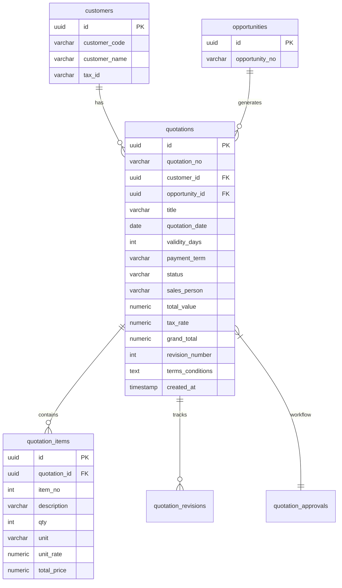

# Quotation Management Module Specification

## 8. Database ER Diagram


## 9. SQL Schema (PostgreSQL)
```sql
CREATE TABLE quotations (
    id UUID PRIMARY KEY DEFAULT gen_random_uuid(),
    quotation_no VARCHAR(50) NOT NULL UNIQUE,
    customer_id UUID REFERENCES customers(id) ON DELETE RESTRICT,
    opportunity_id UUID REFERENCES opportunities(id) ON DELETE SET NULL,
    title VARCHAR(255) NOT NULL,
    quotation_date DATE NOT NULL,
    validity_days INT DEFAULT 30,
    payment_term VARCHAR(100),
    status VARCHAR(50) DEFAULT 'Draft',
    sales_person VARCHAR(100),
    total_value NUMERIC(15, 2) DEFAULT 0,
    tax_rate NUMERIC(5, 2) DEFAULT 7,
    grand_total NUMERIC(15, 2) DEFAULT 0,
    revision_number INT DEFAULT 0,
    terms_conditions TEXT,
    created_at TIMESTAMP WITH TIME ZONE DEFAULT NOW()
);

CREATE TABLE quotation_items (
    id UUID PRIMARY KEY DEFAULT gen_random_uuid(),
    quotation_id UUID REFERENCES quotations(id) ON DELETE CASCADE,
    item_no INT NOT NULL,
    description TEXT NOT NULL,
    qty INT NOT NULL DEFAULT 1,
    unit VARCHAR(50),
    unit_rate NUMERIC(15, 2) NOT NULL,
    total_price NUMERIC(15, 2) NOT NULL
);

CREATE INDEX idx_quotations_customer ON quotations(customer_id);
CREATE INDEX idx_quotations_status ON quotations(status);
```

## 10. API Response Schema
```json
{
  "id": "q1ef4942-83b3-4f9e-bbb4-7a0df47ab001",
  "quotation_no": "QT-0001-26",
  "revision_number": 0,
  "customer_id": "c1ef4942-83b3-4f9e-bbb4-7a0df47a0001",
  "title": "Boiler Maintenance Equipment Rental",
  "quotation_date": "2026-06-16",
  "validity_days": 30,
  "payment_term": "30 Days",
  "status": "Approved",
  "sales_person": "เอกชัย วงศ์ดี",
  "total_value": 380000.00,
  "tax_rate": 7,
  "grand_total": 406600.00,
  "terms_conditions": "1. Deliver within 7 days...",
  "items": [
    {
      "item_no": 1,
      "qty": 1,
      "unit": "Set",
      "description": "HP Hot Boiler Wash Tooling Set",
      "unit_rate": 30000.00,
      "total_price": 300000.00
    }
  ]
}
```

## 11. React Component Structure
- `QuotationManagement.tsx` : Root Module Component
    - `<header>` : Application Bar with Create button
    - Tabs : Dashboard | Quotation List
    - `KPICard` : Dashboard metrics mapping to Draft, Approved, Pendings
    - `QuoteList` : Data grid with Search/Status Filters, mapping row records
        - `StatusBadge` : Visual indicator component
    - `QuoteForm` : Dynamic React form for creation & editing (incl. line item sub-form)
    - `PrintPreview` : Pixel-perfect print-to-pdf component mapping structural standard Thai enterprise layouts.

## 12. Complete Enterprise UI Mockup & Workflow
- **Creation Rule**: Auto-run sequence (`QT-0001-26`), calculation auto-derives from Items Subtotal + VAT (7%).
- **PDF Gen**: Built into the `PrintPreview` DOM target, optimized for `@page { size: A4 }` avoiding margin bleeds and preserving border strictness.
- **Convert-to-SO / Emailing**: Handled functionally via status badges; when `Approved`, actions expand for sending out or converting.
